<div align="center">

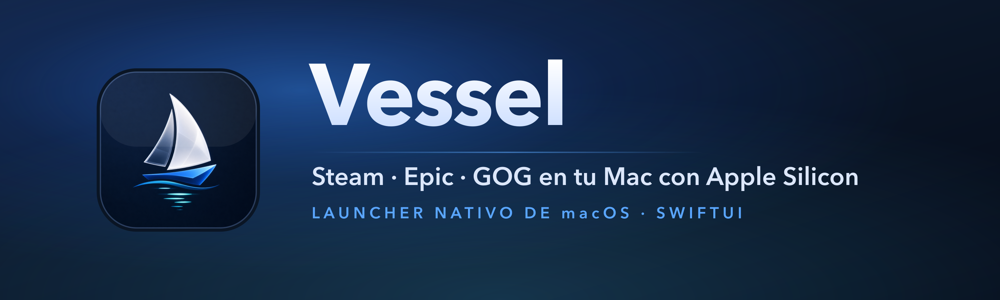

<br/>

<a href="https://github.com/SwonDev/Vessel/releases/latest"></a>
&nbsp;
<a href="#instalación-desde-el-código"></a>

<br/><br/>


<br/><br/>

<sub>
<a href="#qué-es-vessel">Qué es</a> &nbsp;·&nbsp;
<a href="#características">Características</a> &nbsp;·&nbsp;
<a href="#capturas">Capturas</a> &nbsp;·&nbsp;
<a href="#tiendas">Tiendas</a> &nbsp;·&nbsp;
<a href="#motores-y-compatibilidad">Compatibilidad</a> &nbsp;·&nbsp;
<a href="#cómo-funciona">Cómo funciona</a> &nbsp;·&nbsp;
<a href="#instalación-desde-el-código">Instalación</a> &nbsp;·&nbsp;
<a href="#licencia-y-créditos">Licencia</a>
</sub>

</div>

<br/>

<div align="center">

<a href="docs/readme-assets/demo.mp4"></a>

<sub><i>Vessel en acción. Pulsa para ver el vídeo demo en alta calidad.</i></sub>

</div>

<br/>

---

## 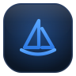 &nbsp;Qué es Vessel

**Vessel** es una app **nativa de macOS** (SwiftUI, Apple Silicon) que envuelve **Wine** y el **Game Porting Toolkit** de Apple para ejecutar juegos de Windows —tu biblioteca de **Steam**, **Epic** y **GOG**— con la sencillez de un launcher de Mac. Del mismo espíritu que CrossOver, Whisky o Mythic, pero escrito en **Swift moderno** y con una obsesión: **que tú solo abras y juegues**.

Todo lo técnico —los *bottles* de Wine, las capas de traducción gráfica, el motor correcto para cada juego— **es invisible**. La barra lateral no muestra "botellas": muestra **tus juegos**. Elegir la capa gráfica, reparar el prefijo o instalar los runtimes que faltan lo hace Vessel por ti, **automáticamente**.

<br/>

## Características

<table>
<tr align="center" valign="top">
<td width="25%">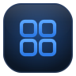<br/><b>Tres tiendas, una biblioteca</b><br/><sub>Steam, Epic y GOG unificadas en una sola vista buscable.</sub></td>
<td width="25%">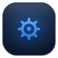<br/><b>Motor óptimo por juego</b><br/><sub>Vessel detecta cada juego y elige la capa gráfica ideal. Sin que toques nada.</sub></td>
<td width="25%">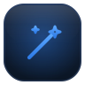<br/><b>Cero fricción</b><br/><sub>Nada de prefijos ni overrides a la vista. Abres la app y juegas.</sub></td>
<td width="25%"><br/><b>Interfaz premium</b><br/><sub>Liquid Glass nativo, gradientes, sombras y microinteracciones suaves.</sub></td>
</tr>
<tr align="center" valign="top">
<td width="25%">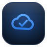<br/><b>Partidas a salvo</b><br/><sub>Copias de guardado locales y modo Steam real opcional por juego.</sub></td>
<td width="25%"><br/><b>Auto-actualización</b><br/><sub>Actualizaciones firmadas (EdDSA) mediante Sparkle.</sub></td>
<td width="25%">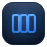<br/><b>Carátulas y compatibilidad</b><br/><sub>Portadas de SteamGridDB y valoración de compatibilidad por juego.</sub></td>
<td width="25%">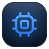<br/><b>100% Apple Silicon</b><br/><sub>Traducción directa a Metal. Rosetta 2 para el código x86, auto-gestionado.</sub></td>
</tr>
</table>

<br/>

## Capturas

<div align="center">

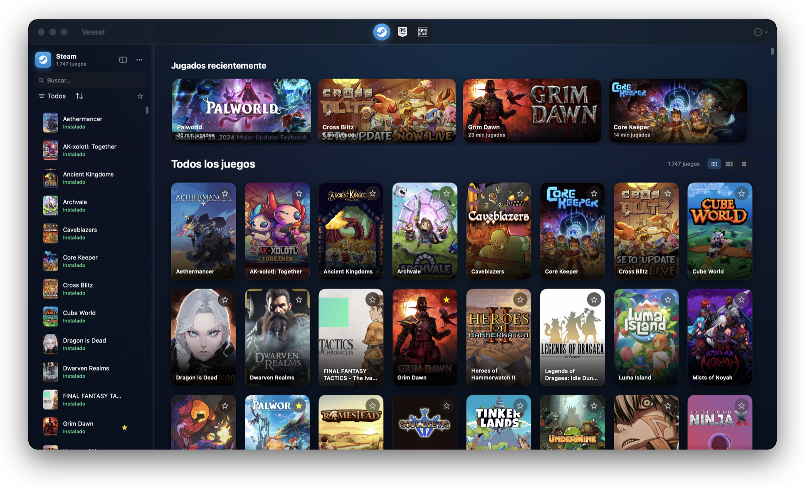

<br/><br/>

<table>
<tr valign="top">
<td width="30%" align="center">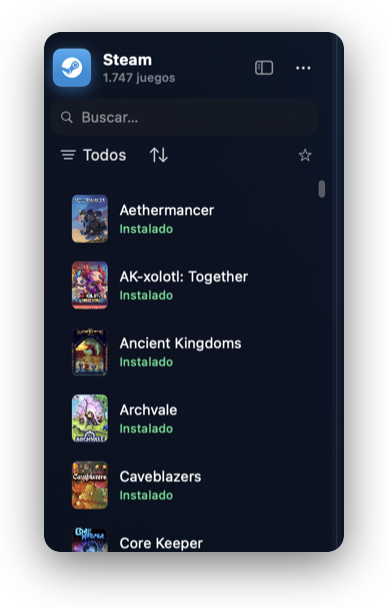<br/><sub><b>Busca y filtra al instante</b><br/>Instalados primero, favoritos y estado por juego.</sub></td>
<td width="70%" align="center">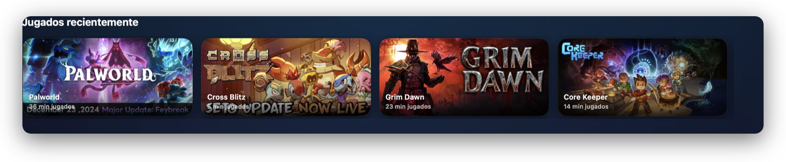<br/><sub><b>Continúa donde lo dejaste</b><br/>Jugados recientemente, con tiempo de sesión.</sub><br/><br/>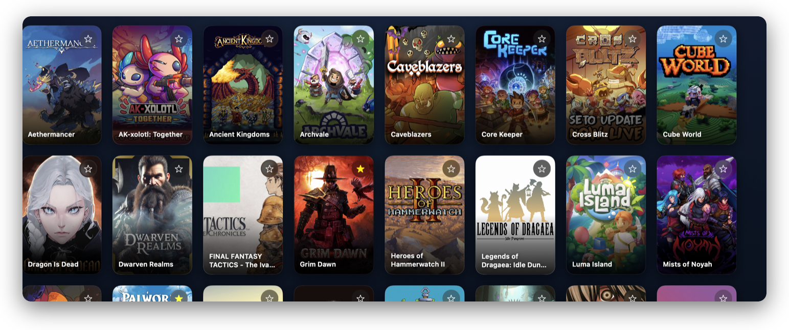<br/><sub><b>Tus carátulas, como en Steam</b><br/>Rejilla vertical con densidad ajustable.</sub></td>
</tr>
</table>

</div>

<br/>

## Tiendas

<table>
<tr align="center" valign="top">
<td width="33%">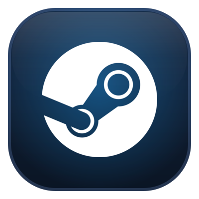<br/><b>Steam</b><br/><sub>Biblioteca, instalar y jugar. <b>Modo Steam real</b> opcional para DRM, nube, logros y DLC nativos.</sub></td>
<td width="33%">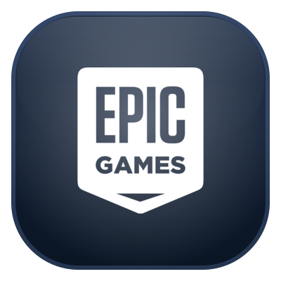<br/><b>Epic Games</b><br/><sub>Login e instalación mediante <code>legendary</code>. Biblioteca completa y actualizaciones.</sub></td>
<td width="33%">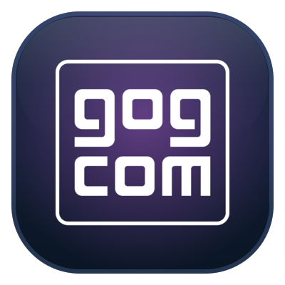<br/><b>GOG</b><br/><sub>Login e instalación mediante <code>gogdl</code>. Catálogo sin DRM y clásicos.</sub></td>
</tr>
</table>

<sub>Además, un **hub sin DRM** para instaladores y bibliotecas de itch.io y Humble. Modelo de lanzamiento estilo Heroic/Mythic: Vessel importa tus juegos y **los lanza él mismo** con el motor óptimo.</sub>

<br/>

## Motores y compatibilidad

Vessel enruta **cada juego a su motor y sus parches**, de forma aislada: un arreglo para un juego nunca toca los demás. Compatibilidad verificada en Apple Silicon (M-series):

<div align="center">

| Motor de juego | Verificado con | Ruta gráfica |
|---|---|:---:|
| Love2D | Balatro | Metal |
| Godot 3 / 4 (OpenGL) | Brotato, Cassette Beasts | Metal |
| Godot 4 (Vulkan) | Halls of Torment | MoltenVK |
| MonoGame | Stardew Valley | Metal |
| RPG Maker | To the Moon | Metal |
| FNA (.NET) | FEZ | Metal |
| XNA | Terraria | Metal |
| Source | Portal | Metal |
| id Tech / KEX | DOOM, DOOM II | Metal |
| Unreal Engine 4 | ASTRONEER | D3DMetal |
| Unity (D3D11 / D3D12) | AK-xolotl, Palworld | DXMT / D3DMetal |
| Cobra (Frontier) | Jurassic World Evolution 2 | D3DMetal |
| Java / JVM | Wurm Unlimited | Metal |
| DirectDraw (clásicos de los 90) | War Wind | Parche propio |

</div>

<sub>Cuando un arranque falla de forma recuperable, Vessel **se auto-repara**: prueba el siguiente motor del *fallback*, instala los runtimes que faltan (VC++/.NET) y **memoriza la capa ganadora** para ese juego.</sub>

<br/>

## Cómo funciona

<table>
<tr valign="top">
<td width="60">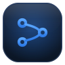</td>
<td>

Vessel **no reimplementa Wine**: lo orquesta. Gestiona los *bottles* (prefijos de Wine), descarga motores portables, integra las capas de traducción gráfica y lanza cada juego con la configuración óptima — todo transparente para ti.

- **Modo Vessel (por defecto):** cada juego se lanza con **su motor y sus fixes**, para la mejor compatibilidad y rendimiento.
- **Modo Steam real (opcional, por juego):** lanza con el cliente de Steam conectado, para DRM real, nube de Steam, logros, DLC y actualizaciones nativas.

En Apple Silicon la traducción gráfica va **directa a Metal** —DXMT para D3D11, D3DMetal/GPTK para D3D12— evitando la capa Vulkan intermedia: la ruta más rápida en Mac.

</td>
</tr>
</table>

<sub>Documentación de arquitectura y estrategia en <a href="docs/"><code>docs/</code></a>.</sub>

<br/>

## Requisitos

<table>
<tr valign="top">
<td width="60">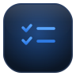</td>
<td>

- **Mac con Apple Silicon** (M1 o superior).
- **macOS 15 (Sequoia) o superior**.
- Espacio para los motores Wine: **se descargan y configuran solos** la primera vez.

</td>
</tr>
</table>

## Instalación (desde el código)

Vessel es **SwiftPM puro**, sin `.xcodeproj`. Para compilarlo y arrancarlo:

```bash
git clone https://github.com/SwonDev/Vessel.git
cd Vessel
./build_and_run.sh
```

El script compila en *release*, monta el `.app`, lo firma *ad-hoc* y lo abre. Los motores Wine, las capas gráficas y los redistribuibles se descargan y configuran **automáticamente** al primer uso.

> ¿Solo quieres jugar? Descarga la app ya compilada desde **[Releases](https://github.com/SwonDev/Vessel/releases/latest)**.

<br/>

## Stack

<table>
<tr valign="top">
<td width="60">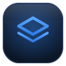</td>
<td>

**Swift 6 · SwiftUI · Apple Silicon (arm64) · macOS 15+** · SwiftPM · `@Observable` · persistencia JSON.

Capas y motores: **Wine** · **DXMT** (D3D11 → Metal) · **DXVK** (D3D9/10/11 → Vulkan, *legacy*) · **Apple Game Porting Toolkit / D3DMetal** (D3D12 → Metal) · **MoltenVK** · **Goldberg** · `legendary` (Epic) · `gogdl` (GOG). Auto-update con **Sparkle**.

</td>
</tr>
</table>

<br/>

## Licencia y créditos

<table>
<tr valign="top">
<td width="60">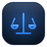</td>
<td>

Vessel se distribuye bajo **GPL-3.0**. Integra y agradece a proyectos de código abierto:

- [**Wine**](https://www.winehq.org) (LGPL-2.1+) — el corazón de la traducción Win32 → macOS.
- [**DXMT**](https://github.com/3Shain/dxmt) (3Shain) — D3D10/11 → Metal directo.
- [**DXVK**](https://github.com/doitsujin/dxvk) · [**MoltenVK**](https://github.com/KhronosGroup/MoltenVK) · [**vkd3d**](https://gitlab.winehq.org/wine/vkd3d).
- **Apple Game Porting Toolkit / D3DMetal** — traducción DirectX → Metal (Apple).
- [**GnuTLS**](https://www.gnutls.org) 3.8.13 (LGPL-2.1+) · [**Nettle**](https://www.lysator.liu.se/~nisse/nettle/) 4.0 · [**FreeType**](https://freetype.org) 2.14.3 — crypto y fuentes del motor.
- [**wine-mono**](https://github.com/wine-mono/wine-mono) 11.2.0 — runtime .NET Framework.
- [**Sparkle**](https://sparkle-project.org) — auto-actualización. Diseño inspirado en [**Mythic**](https://github.com/MythicApp/Mythic).

</td>
</tr>
</table>

> Vessel **no** incluye ni redistribuye código propietario de terceros. Los motores base son builds **FOSS** (WineHQ 11.10 limpio y una build propia de las fuentes libres de CrossOver 26.2.0, ambas LGPL-2.1+); las capas se descargan de sus fuentes oficiales.
>
> Cumplimiento LGPL, fuente correspondiente y parches del motor: ver **[`docs/ENGINE-SOURCE.md`](docs/ENGINE-SOURCE.md)**.

<br/>

<div align="center">


<br/>

**Diseñado y desarrollado por [SwonDev](https://github.com/SwonDev)**

<sub>Bundle ID <code>com.swondev.vessel</code> · macOS · Apple Silicon</sub>

</div>
