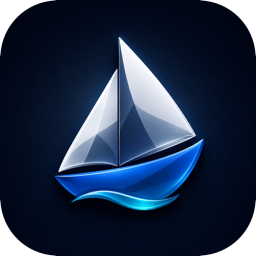
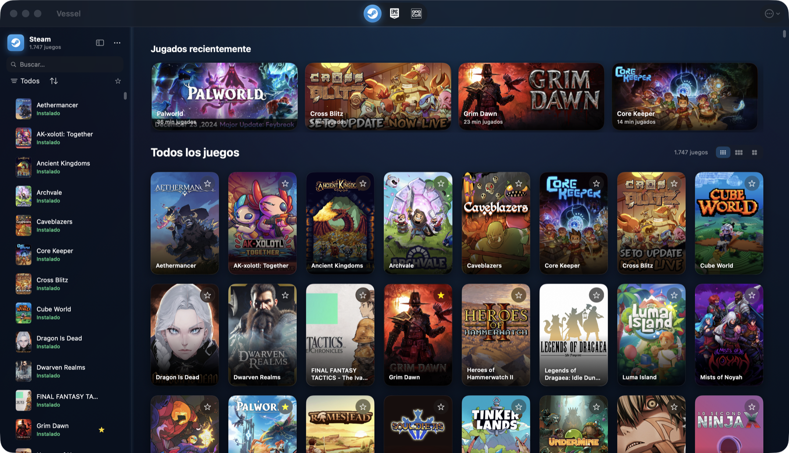

<div align="center">



# Vessel

### Juega a **Steam**, **Epic** y **GOG** en tu Mac con Apple Silicon.

*Nativo. Sin complicaciones. Premium.*


</div>

<p align="center">
  
</p>

---

## ✨ Qué es Vessel

**Vessel** es una app **nativa de macOS** (SwiftUI, Apple Silicon) que envuelve **Wine** + el **Game
Porting Toolkit** de Apple para ejecutar juegos de Windows —tu biblioteca de **Steam**, **Epic** y
**GOG**— con la sencillez de un launcher de Mac. Del mismo espíritu que CrossOver, Whisky o Mythic,
pero escrito en **Swift moderno** y con una obsesión: **que tú solo abras y juegues**.

Todo lo técnico (los *bottles* de Wine, las capas de traducción gráfica, el motor correcto para cada
juego) **es invisible**. La barra lateral no muestra "botellas": muestra **tiendas**.

> 🎯 **Filosofía:** el usuario abre Vessel y juega. Elegir la capa gráfica, reparar el prefijo,
> configurar el motor óptimo por juego… lo hace Vessel por ti, automáticamente.

---

## 🎮 Características

| | |
|---|---|
| 🕹️ **3 tiendas en una** | Steam, Epic Games (vía `legendary`) y GOG (vía `gogdl`), en una biblioteca unificada. |
| 🧠 **Motor óptimo por juego** | Vessel detecta cada juego y lo lanza con la capa correcta (**DXMT** para D3D11→Metal directo, **D3DMetal/GPTK** para D3D12 y Unreal/Unity, y motores propios con parches puntuales) — **sin que toques nada**. |
| 🪄 **UX invisible** | Nada de *bottles*, prefijos ni overrides a la vista. Abres y juegas. |
| 🎨 **UI premium** | Inspiración *Mythic*: materiales y blur, gradientes animados con Metal, sombras, microinteracciones y transiciones suaves. |
| ☁️ **Partidas a salvo** | Copias de guardado locales (manifiesto *ludusavi*) y **modo Steam real** opcional por juego (nube, logros, DLC y actualizaciones nativas). |
| 🔄 **Auto-actualización** | Actualizaciones firmadas (EdDSA) con **Sparkle**. |
| 🖼️ **Carátulas y compatibilidad** | Portadas de SteamGridDB y valoraciones de compatibilidad por juego. |
| 🍎 **100 % Apple Silicon** | Metal directo (sin capa Vulkan intermedia), Rosetta 2 para el código x86, todo auto-gestionado. |

---

## 🕹️ Tiendas soportadas

<div align="center">

| Steam | Epic Games | GOG |
|:---:|:---:|:---:|
| Biblioteca, instalar y jugar. **Modo Steam real** opcional (DRM/nube). | Login e instalación vía `legendary`. | Login e instalación vía `gogdl`. |

</div>

---

## 🚀 Requisitos

- **Mac con Apple Silicon** (M1 o superior).
- **macOS 15 (Sequoia) o superior**.
- Espacio para los motores Wine (se descargan solos la primera vez).

## 📦 Instalación (desde el código)

Vessel es **SwiftPM puro**, sin `.xcodeproj`. Para compilarlo y arrancarlo:

```bash
git clone https://github.com/SwonDev/Vessel.git
cd Vessel
./build_and_run.sh
```

El script compila en *release*, monta el `.app`, lo firma *ad-hoc* y lo abre. Los motores Wine, las
capas gráficas y los redistribuibles se descargan y configuran **automáticamente** al primer uso.

---

## 🧠 Cómo funciona

Vessel **no reimplementa Wine**: lo orquesta. Gestiona *bottles* (prefijos de Wine), descarga motores
portables, integra las capas de traducción gráfica y lanza cada juego con la configuración óptima —
todo transparente para ti.

- **Modo Vessel (por defecto):** cada juego se lanza con **su motor y sus fixes** (la mejor
  compatibilidad y rendimiento por juego).
- **Modo Steam real (opcional, por juego):** lanza con el cliente de Steam conectado, para DRM real,
  nube de Steam, logros, DLC y actualizaciones nativas.

En Apple Silicon la traducción gráfica va **directa a Metal** (DXMT para D3D11, D3DMetal/GPTK para
D3D12), evitando la capa Vulkan intermedia — la ruta más rápida en Mac.

📄 Documentación de arquitectura y estrategia en [`docs/`](docs/).

---

## 🛠️ Stack

**Swift 6 · SwiftUI · Apple Silicon (arm64) · macOS 15+** · SwiftPM · `@Observable` · persistencia JSON.

Capas y motores: **Wine** · **DXMT** (D3D11→Metal) · **DXVK** (D3D9/10/11→Vulkan, *legacy*) ·
**Apple Game Porting Toolkit / D3DMetal** (D3D12→Metal) · **MoltenVK** · **Goldberg** ·
`legendary` (Epic) · `gogdl` (GOG). Auto-update con **Sparkle**.

---

## ⚖️ Licencia y créditos

Vessel se distribuye bajo **GPL-3.0**. Integra y agradece a proyectos de código abierto:

- [**Wine**](https://www.winehq.org) (LGPL-2.1+) — el corazón de la traducción Win32→macOS.
- [**DXMT**](https://github.com/3Shain/dxmt) (3Shain) — D3D10/11 → Metal directo.
- [**DXVK**](https://github.com/doitsujin/dxvk) · [**MoltenVK**](https://github.com/KhronosGroup/MoltenVK) · [**Vkd3d**](https://gitlab.winehq.org/wine/vkd3d).
- **Apple Game Porting Toolkit / D3DMetal** — traducción DirectX → Metal (Apple).
- [**Sparkle**](https://sparkle-project.org) — auto-actualización.
- Diseño inspirado en [**Mythic**](https://github.com/MythicApp/Mythic).

> Vessel **no** incluye ni redistribuye código propietario de terceros. Los motores y las capas se
> descargan de sus fuentes oficiales o de las *releases* públicas del proyecto.

<div align="center">

Hecho con ❤️ por **[SwonDev](https://github.com/SwonDev)**

</div>
